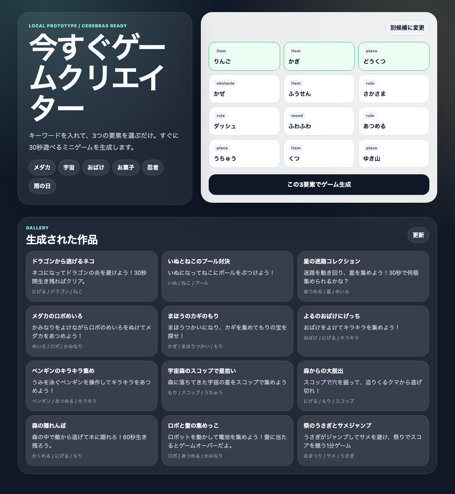

# 今すぐアプリクリエイター / Instant App Creator

作りたいものを自由入力すると、LLM が自己完結の単一 HTML アプリを即実装し、sandbox 付き iframe で実行するローカル試作品です。



## できること

- 200字以内のアイデアを自由入力
- 任意で「ふくらませ方」カードを3〜4件生成
- カードを選ぶ、またはスキップしてそのまま生成
- Cerebras API で単一 HTML 文書を生成
- APIキー未設定時はおみくじアプリのモックで即動作確認
- 保存前に HTML 構造・禁止トークン・script構文を検査
- CSP meta を強制注入してから保存
- `<iframe sandbox="allow-scripts" srcdoc>` で即実行
- ローカル JSON に保存、`/g/:slug` の共有URL、ギャラリー表示

## 技術構成

- SvelteKit / Svelte 5
- sandbox iframe + srcdoc
- SvelteKit server endpoints
- ローカル保存: `.local-data/apps.json`
- Cerebras API: サーバー側から `https://api.cerebras.ai/v1/chat/completions` を呼び出し

## セットアップ

```bash
cp .env.example .env
bun install
bun run dev
```

ブラウザで http://localhost:5173 を開きます。

## Cerebras API を使う場合

`.env` に API キーを設定します。

```bash
CEREBRAS_API_KEY=your-api-key
CEREBRAS_MODEL=zai-glm-4.7
CEREBRAS_MOCK=0
```

- API キーを入れない場合は自動的にモック生成になります（強制モックは `CEREBRAS_MOCK=1`）
- 方向カード生成は temperature 0.8 / max_tokens 800 / timeout 10秒 / リトライなし
- アプリ生成は max_tokens 20000 / timeout 60秒 / 最大2回試行
- GLM 系は reasoning が本文を圧迫しやすいため、既定で `reasoning_effort: none` を送信します（`CEREBRAS_REASONING_EFFORT` で変更可）

## ディレクトリ構成

```text
src/routes/+page.svelte                    トップ画面・方向カード・ギャラリー
src/routes/g/[id]/+page.svelte             共有表示画面
src/routes/api/directions/+server.ts       方向カードAPI
src/routes/api/generate/+server.ts         HTML生成API
src/routes/api/games/+server.ts            一覧API（既存パスを継続利用）
src/lib/components/HtmlAppFrame.svelte     sandbox iframe 実行ランナー
src/lib/server/cerebras.ts                 Cerebras API 呼び出し
src/lib/server/prompt.ts                   生成プロンプト
src/lib/server/validateGeneratedHtml.ts    生成HTMLの検証 + CSP注入
src/lib/server/mockApp.ts                  APIキーなし用のモック生成
src/lib/server/storage.ts                  ローカルJSON保存
```

## 設計判断

### 1. 生成物は単一 HTML 文書に限定

LLM が返す成果物を `title`, `summary`, `howToUse`, `html` の4キーに固定し、実行対象は `html` だけにします。ビルドや外部ファイル保存を挟まず、生成後すぐに iframe で表示できます。

### 2. 安全境界は sandbox iframe

実行時は `<iframe sandbox="allow-scripts" srcdoc>` を使い、`allow-same-origin` を付けません。生成HTMLは opaque origin で動くため、親ページの DOM・Cookie・Storage から切り離されます。

### 3. 保存前に CSP を強制注入

`injectCsp()` は既存の CSP meta を除去してから、以下の CSP を `<head>` 直後へ注入します。

```text
default-src 'none'; script-src 'unsafe-inline'; style-src 'unsafe-inline'; img-src data: blob:; media-src data: blob:; font-src data:; connect-src 'none'
```

### 4. 検証は品質フィルタ

`validateGeneratedHtml.ts` は JSON抽出、4キー検証、HTML構造検査、禁止トークン検査、`<script>` ブロックの構文検査を行います。実行スモークは false positive を避けるため行わず、安全性は sandbox と CSP に寄せます。

## 次にやると良いこと

- 共有ページから追加指示で作り直すリミックス導線
- 生成失敗ログとプロンプト改善用の集計
- iframe 内の外部リクエスト監視を含むブラウザQA
- Cloudflare D1/R2 移行
